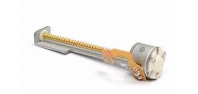
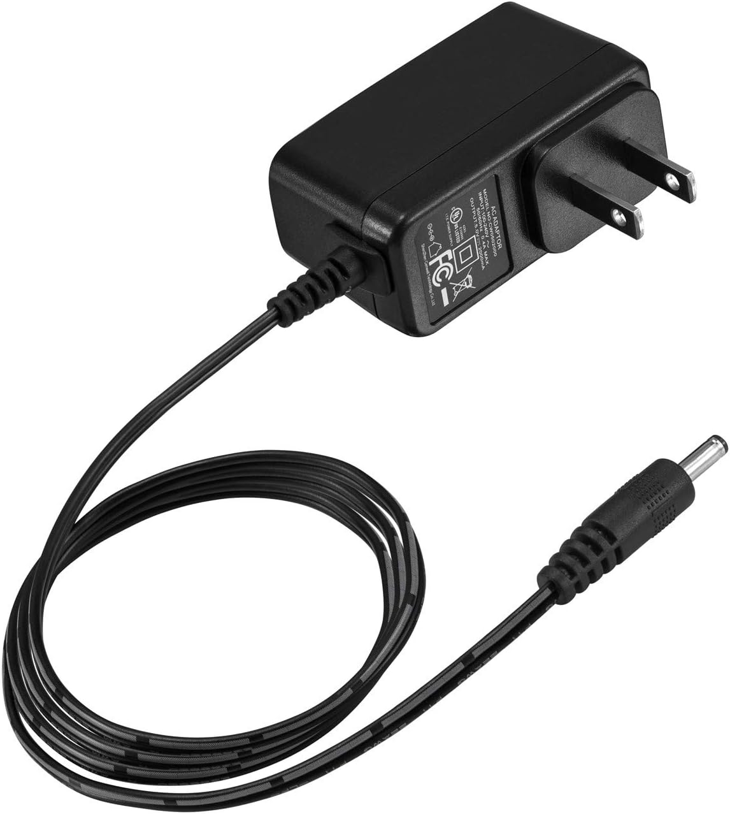
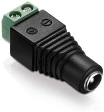
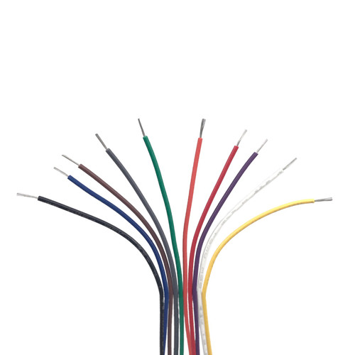

# GROUND TRUTH

## Convertir imágenes a SVG

https://picsvg.com/

## Partes para construir la impresora

Para crear las ilustraciones del libro usamos una pequeña impresora CNC creada con estos elementos (se podría usar un motor servo para levantar y bajar el lapicero, el código interpreta los comandos para hacer esto pero nuestra versión hace líneas continuas para dibujar. Por eso no incluimos los servo acá):7

### Electrónica

| Cantidad | Descripción                                                                                                                                                                                                                                                | Foto                                                                                    |
| -------- | ---------------------------------------------------------------------------------------------------------------------------------------------------------------------------------------------------------------------------------------------------------- | --------------------------------------------------------------------------------------- |
| 2        | Unidades de DVD viejas, de allí sacamos los motores con varilla roscada (también las varillas lisas de 3mm que tenga la unidad, estas van a ser útiles para la construcción mecánica).                                                                     |                      |
| 1        | Arduino Uno                                                                                                                                                                                                                                                |                                  |
| 1        | Controlador de motores HW - 130 (o cualquiera con L293D, hay variaciones de estos por ahí).                                                                                                                                                                |                    |
| 1        | Fuente de poder conectada a "EXT_PWR". La placa acepta fuente desde 4.5 a 25V DC. Una fuente pequeña es suficiente, de 5V y 1 amperio está bien. (Con fuentes más potentes los motores pueden funcionar pero se calientan mucho y se pueden dañar pronto). |                                   |
| 1        | Conector cilíndrico a terminales de dos polos.                                                                                                                                                                                                             |  |
|          | Cable para conectar los motores al controlador, pueden ser de 26 o 22 AWG                                                                                                                                                                                  |                                                 |

- Cuando tiene el puente, los motores y Arduino comparten la corriente, por ejemplo, el cable USB conectado al computador que da 5V.
- Sin el puente, se debe conectar una fuente de poder externa para los motores ya que no comparte la fuente de poder con el Arduino. Esto sirve para darle suficiente poder a los motores sin usar la del USB que ya alimenta el Arduino. Acá usamos esta configuración.

### Partes mecánicas

- Partes 3D: Luego de probar varias versiones de este diseño, nos quedamos con esta versión que funciona relativamente bien: https://www.thingiverse.com/thing:6203330
- 5 x varilla lisa de 3mm. : 2 para el eje X, 2 para el eje Y y 1 para el eje Z. Estas varillas las sacamos de las unidades de DVD de donde sacamos los motores.
- 4 x tornillos M4 para sujetar los brazos laterales a la base.
- 1 resorte, se puede sacar de un lapicero.
